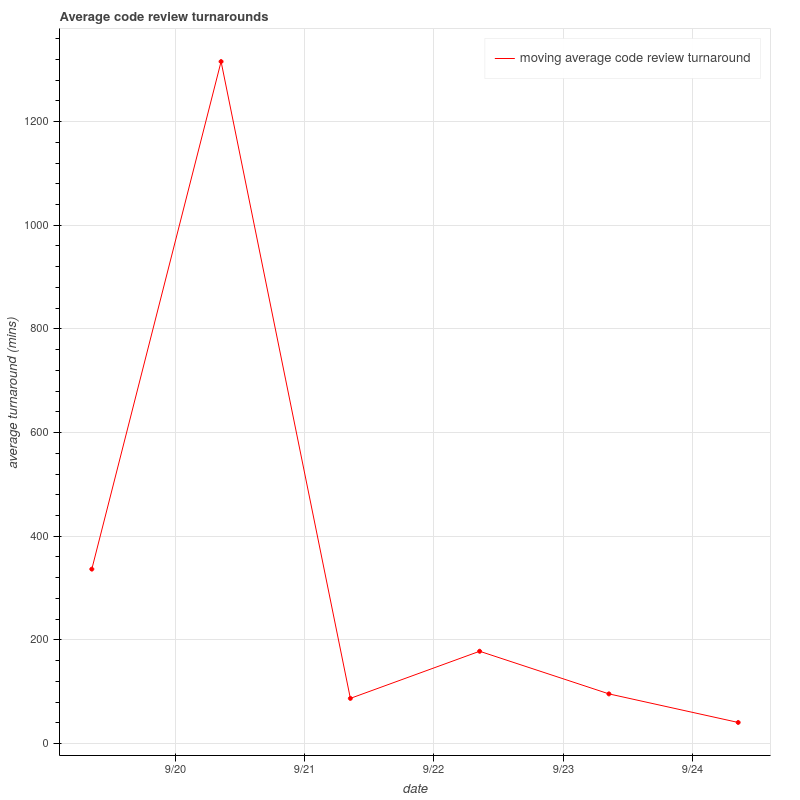

# GRT

- [Introduction](#Github-Code-Review-Turnaround)
- [API](#API)
- [Deployment](#Deployment)

## Github Code Review Turnaround

Track and view code review turnaround for your github repository. Code review turnaround is the time taken between the code review assignment and completion. This metric helps to determine if code reviews are being blockers for a team and if any optimization in the code reivew process is required.

GRT uses github webhooks to maintain a database of code review requests and submissions. It offers an api to generate an html report or return a json response of the average turnarounds.



## API

The average turnarounds can be fetched with a simple GET request. The root endpoint is different based on the [deployment](#Deployment).

```
GET /turnarounds/?last={last}&period={period}&plot={plot}
```

For eg. `GET /turnarounds/?last=week&period=day&plot=true` provides you an html chart of the turnarounds of the last week, averaged over a day

### Query Params

- `last:str` : the duration since the request to get the average turnarounds. Only `week` or `month` supported for now. Defaults to `week`.
- `period:str` : the period to calculate the average over. Only `day` or `week` supported for now. Defaults to `day`.
- `plot:bool` : whether to view a plot or not. Defaults to `true`.

### Responses

- If `plot` is `true` returns an html chart of the average turnarounds.

- If `plot` is `false` returns a json response with dates as keys and corresponding average turnarounds in minutes. A value of `0` denotes no code reviews were completed in that period. An example response of `GET /turnarounds/?plot=false` request:

```json
{
  "2020-09-18T09:00:22": 0, 
  "2020-09-19T09:00:22": 454.88,
  "2020-09-20T09:00:22": 1315.75,
  "2020-09-21T09:00:22": 87.13,
  "2020-09-22T09:00:22": 178.05,
  "2020-09-23T09:00:22": 95.83,
  "2020-09-24T09:00:22": 40.7,
  "2020-09-25T09:00:22": 0
}
```

### Client Errors

- `400 Bad Request` - if `last` or `period` are bad values 

## Deployment

*GRT* is deployed on [Deta micros](https://docs.deta.sh/docs/micros/about). It uses [Deta Base](https://docs.deta.sh/docs/base/about) for storing information about the reviews.

The following instructions are valid only for deploying to a Deta Micro. If you need to deploy to a different cloud platform or need a different database, please refer to the corresponding platform's deployment process or database setup.

### Clone the repository

- Clone the repository

```shell
$ git clone https://github.com/aavshr/grt
```

### Deploy on Deta

You will need to have the [Deta CLI](https://docs.deta.sh/docs/cli/install) installed.

- Change the directory to the cloned directory and enter

```shell
$ deta new
```

You should see the output that the application has been created and the dependencies have been installed.

- After installing the app, enter

```shell
$ deta details
```

You should see details about your application in your ouptut. The `endpoint` shown will be needed later to add as the webhook url on github.

- Lastly disable auth by entering

```shell
$ deta auth disable
```

We will use a webhook secret to verify that the events are coming from github on our webhook endpoint.

### Set up the webhook

- Go to the `Webhooks` under `Settings` for your repository and click on `Add Webhook`.

- In the `Payload URL` copy the endpoint from output of `deta details` and use the following url as the webhook endpoint. 

```
{your_endpoint}/webhook_events
```

- Change the `Content type` to `application/json`

- Generate a long secure random string (there are services online that do this) and use that as the *Webhook Secret*. Keep hold of this secret as you will need it to [set up the app's environment](#Set-up-the-environment) later.

- Select `Let me select individual events` when selecting the events to trigger the webhook. Select the following events:
    - `Pull requests` : To know when a code review is requested
    - `Pull requests reviews` : To know when a code review has been submitted or deleted

- Click on `Add Webhook` to add the webhook.

### Set up the environment

The webhook secret used in setting up the webhook is provided through an environment variable `WEBHOOK_SECRET`. 

- Create a `.env` file in the app's root directory and add your secret in the file. **Make sure not to expose this file publicly**.

```
WEBHOOK_SECRET=your_webhook_secret
```

- Update the enviroment variables of your app

```shell
$ deta update -e .env
```

You should see that the enviornment variables have been sucessfully updated.

The application should now keep track of code review turnarounds and you can use the api to fetch them.